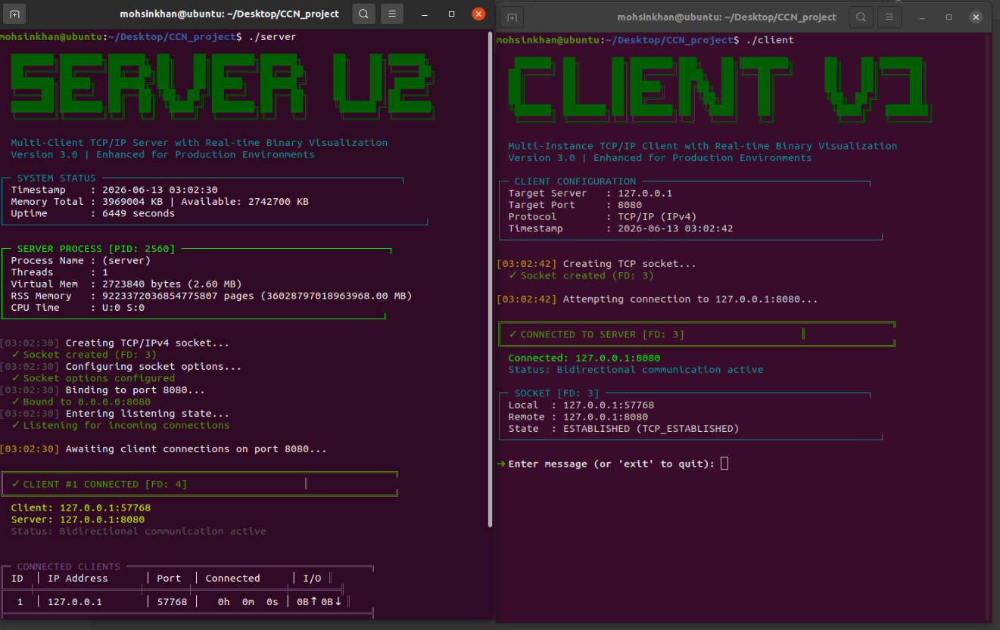
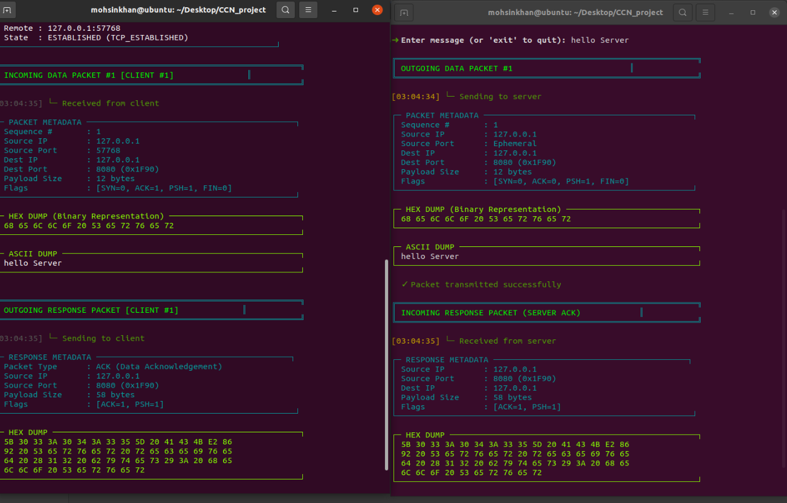

# 🌐 Advanced TCP/IP Communication & Packet Analysis Framework

A professional multi-threaded TCP/IP client-server communication framework developed in C that provides real-time packet inspection, protocol visualization, binary analysis, connection monitoring, and interactive network diagnostics through an advanced terminal-based interface.


---

## 📌 Project Overview

This project implements a complete TCP/IPv4 communication system that not only enables reliable client-server messaging but also provides detailed visibility into the internal structure of network communication.

Unlike traditional socket programming projects that simply exchange messages, this framework visualizes packet transmission, protocol metadata, payload contents, and connection statistics in real time, allowing users to observe how application-layer data travels through the TCP/IP stack.

The project serves as both:

- A functional communication platform
- A network protocol learning environment
- A packet visualization and monitoring system
- A practical demonstration of TCP/IP communication internals

---

# 🎯 Key Features

## 🔹 Multi-Threaded TCP Server

- Concurrent client handling using POSIX Threads
- Independent client sessions
- Dynamic client registration and cleanup
- Thread-safe resource management
- Real-time connection monitoring
- Active client dashboard

---

## 🔹 Real-Time Packet Analysis

For every packet exchanged between client and server, the framework displays:

- Packet Sequence Number
- Source IP Address
- Destination IP Address
- Source Port
- Destination Port
- Payload Length
- TCP Flags
- Communication Direction
- Transmission Timestamp

---

## 🔹 Binary & Hexadecimal Inspection

Every transmitted payload is automatically analyzed and displayed in multiple formats.

### Hexadecimal Representation

```text
68 65 6C 6C 6F 20 53 65 72 76 65 72
```

### ASCII Representation

```text
hello Server
```

### Binary Representation

```text
01101000 01100101 01101100 01101100 01101111
```

This allows users to understand how application-layer data is encoded and transmitted across the network.

---

## 🔹 TCP/IP Protocol Visualization

The framework visualizes communication across multiple networking layers.

### Layer 7 – Application Layer

- User Messages
- Server Responses
- Payload Processing

### Layer 4 – Transport Layer

- TCP Communication
- Source & Destination Ports
- ACK Handling
- Session Tracking
- TCP Flags Analysis

### Layer 3 – Network Layer

- Source IP Address
- Destination IP Address
- Routing Information
- TTL Visualization

### Layer 2 – Data Link Layer (Simulated)

- Ethernet Frame Structure
- MAC Address Representation
- Frame Type Visualization

---

## 🔹 Real-Time Monitoring Dashboard

The server continuously tracks:

- Active Clients
- Total Connections
- Packets Processed
- Bytes Sent
- Bytes Received
- Total Throughput
- Session Duration
- Connection Status

---

## 🔹 Professional Terminal User Interface

Features a cybersecurity-inspired interface including:

- ANSI Color Rendering
- Dynamic Status Indicators
- Packet Monitoring Panels
- Structured Information Tables
- Real-Time Event Logging
- Binary Visualization Panels
- Connection Activity Dashboard

---

# 📊 Packet Information Displayed

The framework captures and visualizes:

| Parameter | Description |
|------------|------------|
| Sequence Number | Packet ordering |
| Source IP | Sender address |
| Destination IP | Receiver address |
| Source Port | Originating port |
| Destination Port | Receiving port |
| Payload Size | Data length |
| TCP Flags | SYN, ACK, PSH, FIN |
| Timestamp | Packet time |
| Hex Dump | Raw packet data |
| ASCII Dump | Human-readable payload |
| Client ID | Session identifier |

---

# 🖼 Screenshots

## Connection Establishment & Monitoring



The server dashboard displays:

- Server initialization
- Process information
- Client connection establishment
- Socket details
- Active client monitoring
- Connection status

---

## Real-Time Packet Analysis



The packet inspection engine displays:

- Incoming packet metadata
- Outgoing packet metadata
- Hexadecimal payload dumps
- ASCII payload decoding
- ACK responses
- Real-time packet tracking

---

# 🏗 System Architecture

```text
+--------------------+
|      CLIENT        |
+--------------------+
| User Input         |
| Packet Generator   |
| Binary Analyzer    |
+---------+----------+
          |
          | TCP/IP
          |
+---------v----------+
|      SERVER        |
+--------------------+
| Connection Manager |
| Packet Analyzer    |
| Thread Manager     |
| Response Engine    |
| Statistics Module  |
+--------------------+
```

---

# 🛠 Technologies Used

### Programming Language

- C (C99 Standard)

### Networking

- TCP/IP
- IPv4
- Berkeley Socket API

### Concurrency

- POSIX Threads (Pthreads)

### Operating Systems

- Linux
- Ubuntu
- Debian
- WSL
- macOS

### System Interfaces

- Linux ProcFS
- POSIX APIs
- Socket Programming APIs

---

# 🚀 Getting Started

## Prerequisites

- Linux / Ubuntu / Debian
- Windows Subsystem for Linux (WSL)
- GCC Compiler
- ANSI-Compatible Terminal

---

## Clone Repository

```bash
git clone https://github.com/mohsinkhan117/server-client-communication.git

cd server-client-communication
```

---

## Compile

### Server

```bash
gcc server.c -o server -pthread
```

### Client

```bash
gcc client.c -o client -pthread
```

---

## Run Server

```bash
./server
```

---

## Run Client

Open a second terminal and run:

```bash
./client
```

---

## Example Communication

### Client Message

```text
hello Server
```

### Server Response

```text
[03:04:35] ACK → Server received (12 bytes): hello Server
```

---

# 📚 Learning Outcomes

This project demonstrates practical understanding of:

- TCP/IP Protocol Stack
- Socket Programming
- Client-Server Architecture
- Multi-Threaded Servers
- Network Packet Analysis
- Binary Data Representation
- Linux System Programming
- Concurrent Computing
- Network Monitoring
- Protocol Visualization

---

# 🔮 Future Enhancements

- SSL/TLS Encryption
- IPv6 Support
- Wireshark Integration
- Raw Socket Packet Capture
- Traffic Analytics Dashboard
- Web-Based Monitoring Interface
- Performance Benchmarking Suite
- Intrusion Detection Features
- Packet Filtering Engine

---

# 👨‍💻 Author

### Mohsin Khan

**Computer Networks Project**

Advanced TCP/IP Communication & Packet Analysis Framework

---

## ⭐ Star this repository if you found it useful.